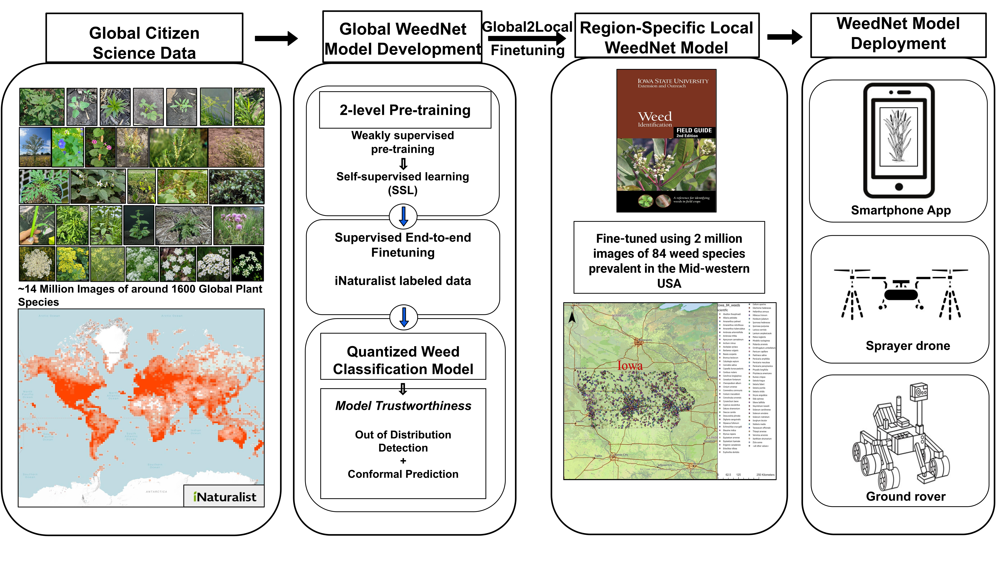

## WeedNet: A Foundation Model-Based Global-to-Local AI Approach for Real-Time Weed Species Identification and Classification.

<p align="center">
  
</p>


This is the repo for the paper [WeedNet: A Foundation Model-Based Global-to-Local AI Approach for Real-Time Weed Species Identification and Classification](https://arxiv.org/pdf/2505.18930):
```
@article{shen2025weednet,
  title={WeedNet: A Foundation Model-Based Global-to-Local AI Approach for Real-Time Weed Species Identification and Classification},
  author={Shen, Yanben and Ayanlade, Timilehin T and Boddepalli, Venkata Naresh and Saadati, Mojdeh and Rairdin, Ashlyn and Deng, Zi K and Arshad, Muhammad Arbab and Balu, Aditya and Mueller, Daren and Singh, Asheesh K and others},
  journal={arXiv preprint arXiv:2505.18930},
  year={2025}
}
```

* This repository is built using [MAE](https://github.com/facebookresearch/mae) repository.

* Installation and preparation follow from [DeiT repo](https://github.com/facebookresearch/deit).

* Note: This repo is based on [`timm==0.3.2`](https://github.com/rwightman/pytorch-image-models), for which a [fix](https://github.com/rwightman/pytorch-image-models/issues/420#issuecomment-776459842) is needed to work with PyTorch 1.8.1+.


### Dataset

Coming Soon. Full dataset will be uploaded to cyverse.

Test and validation set can be found at [link](https://iastate.box.com/s/25otoybllhwtfvnr1ovv26wc74ofdbso)


### Pre-training

The pre-training instruction is in [PRETRAIN.md](PRETRAIN.md).


### Pre-trained checkpoints for global and local Weed Models

Coming Soon.

The fine-tuning instruction is in [FINETUNE.md](FINETUNE.md).


### Acknowledgement

This repository is built using [MAE](https://github.com/facebookresearch/mae) repository.

### License

See [LICENSE](LICENSE) for details.
